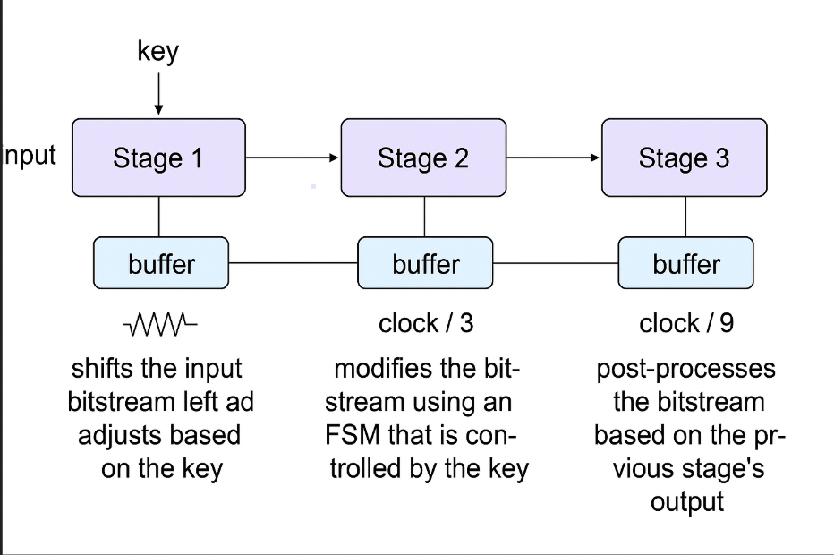
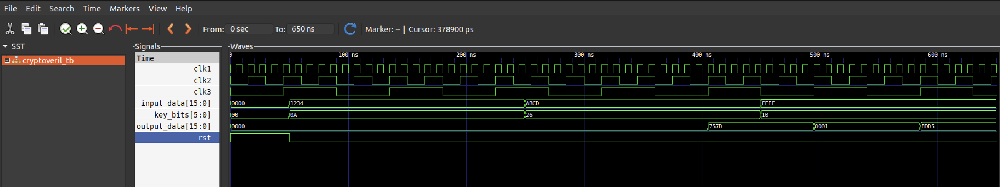

# Crypto Pipelining (3-Stage Encrypted Hardware System)

This project implements a 3-stage pipelined cryptographic transformation system using Verilog, simulating a real-world asynchronous hardware pipeline with multi-clock domains. It includes:

✅ Input transformation  
✅ FSM-driven state logic  
✅ Cleanup and post-processing  
✅ Reverse module to restore original input  
✅ GTKWave trace of full pipeline and FSM  

---

## Features

- **16-bit input processing** through 3 modular stages
- 6-bit compact control key used to drive transformations
- Three independent clocks (`clk1`, `clk2`, `clk3`)
- FSM with 4 states (logic, parity, sign-ext, transitions)
- Handshake-controlled buffers between each stage
- **Reverse pipeline** included to recover original input
- GTKWave waveform analysis (`gtkwave.png`)

---

## Architecture Overview

---

## Reverse Module

The `cryptoveril_reverse.v` module performs a **step-by-step undo** of all pipeline transformations. It receives the encrypted output and same `key_bits`, then:

1. **Stage 3 Reverse**: Removes padding/parity/sign-extension
2. **Stage 2 Reverse**: Runs the FSM transitions in reverse
3. **Stage 1 Reverse**: Reverses the left-shift and subtraction

> The reverse design ensures end-to-end testability and functional correctness in cryptographic pipelines — ideal for embedded and secure hardware systems.

---

## Waveform Snapshot

This waveform captures the internal timing and data flow across the 3-stage cryptographic pipeline. It verifies correct pipeline latency, clock domain separation, and data transformation behavior.

### Signal Breakdown

| Signal Name | Role |
|-------------|------|
| clk1 | Clock for Stage 1 (shift + arithmetic) – Fastest |
| clk2 | Clock for Stage 2 (FSM logic) – 1/3 speed of clk1 |
| clk3 | Clock for Stage 3 (cleanup) – 1/9 speed of clk1 |
| input_data[15:0] | 16-bit input given at testbench intervals |
| key_bits[5:0] | 6-bit control word used by all three stages |
| output_data[15:0] | Final 16-bit transformed output from Stage 3 |
| rst | Global reset, deasserted early to allow normal operation |

### Interpretation by Timestamp

#### --> 0–60ns: System Initialization
rst is low → pipeline begins operating.

Clocks start toggling asynchronously.

No input has been registered yet.

#### --> ~70ns: First Input Applied
input_data = 0x1234

key_bits = 0x0A

These values feed into Stage 1, processed by shift and arithmetic.

#### --> ~150–300ns: First Output Appears
After ~3 full stages of latency, output_data = 0x757D

Verifies the correct path:
input_data (0x1234) → S1 → S2 → S3 → 0x757D

#### --> ~250ns: Second Input
input_data = 0xABCD, key_bits = 0x26

This pair enters pipeline while earlier pair is in Stage 2/3.

Pipeline allows multiple concurrent transformations.

#### --> ~450ns: Third Input
input_data = 0xFFFF, key_bits = 0x10

#### --> ~500ns: Second Output
For 0xABCD / 0x26 → output = 0x0001

#### --> ~600ns: Third Output
For 0xFFFF / 0x10 → output = 0xFDD5

---

## Testbench

Testbench (`cryptoveril_tb.v`) includes:

- 3+ input-key combinations
- Reset and clock generation
- Output validation and FSM tracing via `$display`
- Waveform generation using `$dumpfile("fsm_trace.vcd")`

---

## Compilation & Simulation

### Used Verilator Simulator

---

## Credits

Developed as part of a Igniters Hackathon 2025 organised by IIITDM Kancheepuram. It focused on pipelined cryptographic transformations with real-world timing and clock-domain challenges.

Link to the problem statement - https://github.com/SCC-IIITDM/Encryption-Decryption-25.git
